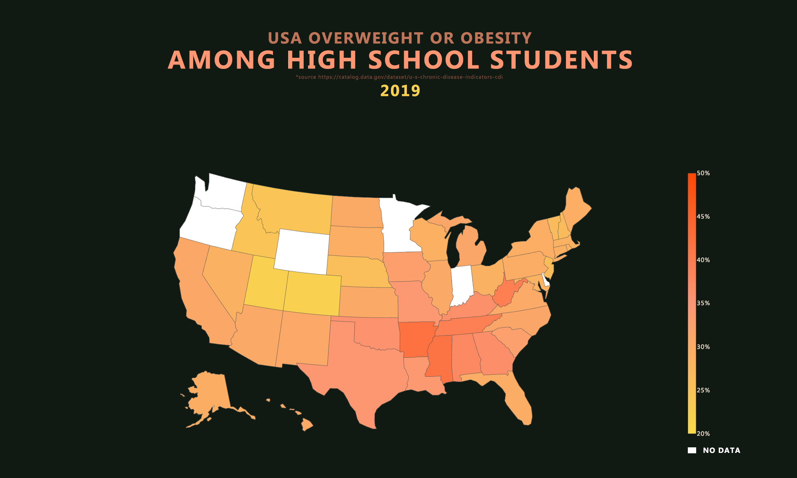
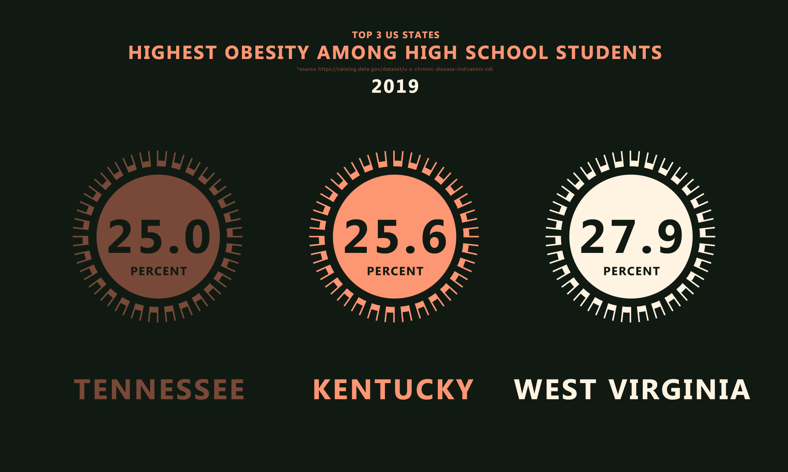
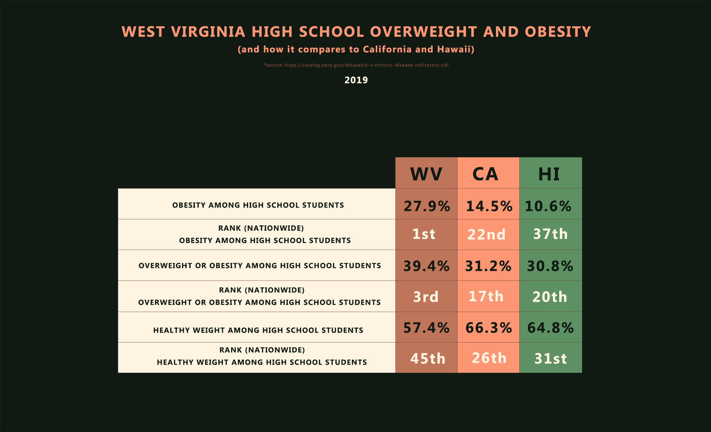
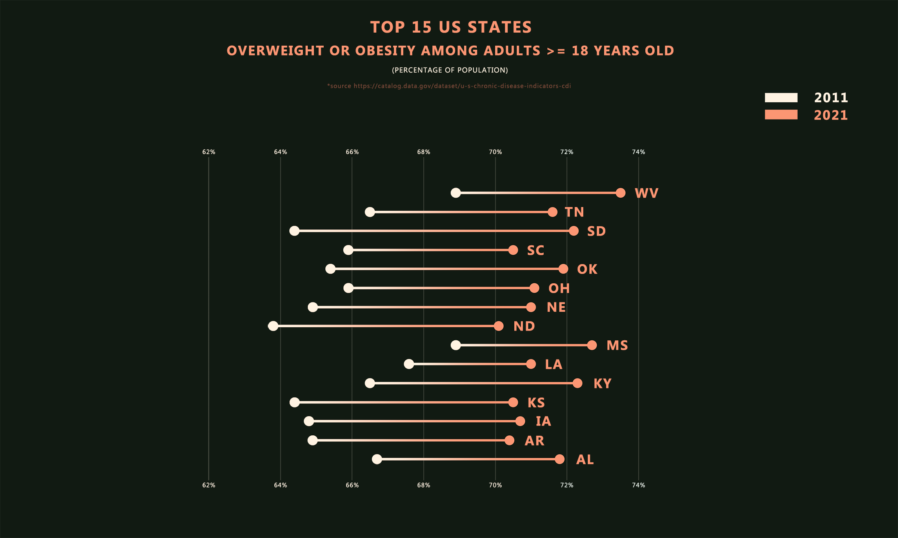

<strong>ABOUT</strong> 
 
Prevelance of technology, less physical activities, and easily accessible processed food have influenced the lives of Gen Z. All three factors, in addition to many others, have changed habits and formed lifestyles that differ from the lifestyles of the previous generations. So how do they all reflect on Gen Z's health, especially those still in their formative teenage years?

The US high school data paints a not so rosy picture. On average, more than 30 percent of students are either overweight or obese. While the problem is more prevelant in the South of the US where some states go close to, or above 40 percent many other states are not that far behind.

Unfortunately, this sheet is missing data for some entries that I found interesting. Although I did explore all entries I ended up not using some. I posted all modules, including those not used in the end, but I commented on those not used.

You can find this data sheet at https://catalog.data.gov/dataset/u-s-chronic-disease-indicators-cdi

<strong>HOW TO NAVIGATE THIS REPO?</strong> 
 
This is a simple repo. Main data package contains our data module with a few simple data clean ups that we then export to use across this project. 
 
The second package, obesity_high_school is the workhorse here. I explored as much as I was offered but ended up not using some modules due to lack of relevant data. All unused modules have comments to inform you of that. 
 
The third package, overweight_or_obesity is sort of a bonus section that shows data for adults over 18 in the US.  
 
As always, the assets folder contains all the charts I made.

<strong>WHAT HAVE I COVERED?</strong> 
 
1. US overweigth or obesity among high school students
2. Top 3 states with highest obesity among high school students
3. Top 10 states with highest overweight or obesity for 2019 and how their numbers compare to 2013
4. West Virginia (No.1 state in HS obesity) high school healthy student weight, overweight or obesity, and obesity
 
Bonus: 
5. Rise in overweight or obesity among US adults 18-65 from 2011-2021
6. Top 15 US states in overweight or obesity among adults 18-65 from 2021 and how their numbers compare to 2011 

<strong>SCREENSHOTS</strong>

